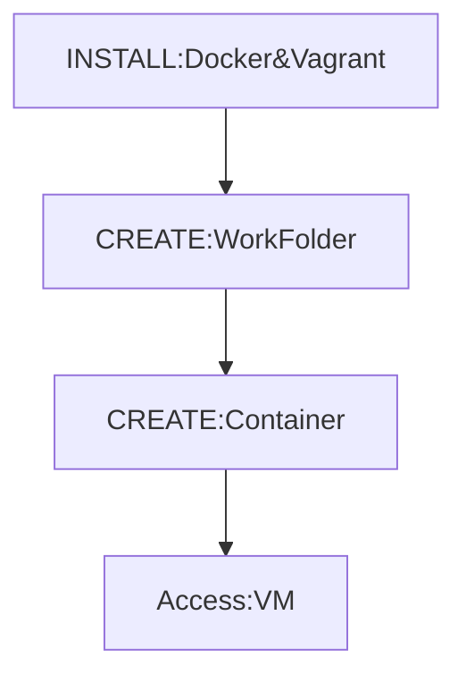

<p align="center">
  
</p>

## Requirements
- Docker installed: you can download the M1 version here [Docker](https://desktop.docker.com/mac/main/arm64/Docker.dmg?utm_source=docker&utm_medium=webreferral&utm_campaign=dd-smartbutton&utm_location=module)
- Vagrant installed: you can also get it here [Vagrant](https://releases.hashicorp.com/vagrant/2.3.0/vagrant_2.3.0_darwin_amd64.dmg) or run `brew install vagrant` on your terminal
- [Dockerfile](Dockerfile)
- [Vagrantfile](Vagrantfile)
- Some [patience]()😮‍💨

## Visual representation of workflow
> All Steps needed to carry out this project include:



## Step 1: Installing Docker + Vagrant

- After installing Docker and Vagrant you need to confirm your installations by running `docker --version` which should give you an output similar to:

```
Last login: Fri Aug 19 11:24:34 on ttys000
[14:55:35] philemonnwanneⓐPhilemonsMac ~ %  docker --version
Docker version 20.10.17, build 100c701
[14:55:41] philemonnwanneⓐPhilemonsMac ~ %
```

- Also running `vagrant --version` should give:

```
[14:55:41] philemonnwanneⓐPhilemonsMac ~ %  vagrant --version
Vagrant 2.3.0
[14:57:23] philemonnwanneⓐPhilemonsMac ~ % 
```

## Step 2: Creating your Development Environment

- Create the directory where you want to initialize the vagrant configuration file

## Step 3: Initializing the Vagrant configuration file
- Naviagate into the directory created in step 2 by running `cd directory-name` 
- While in that directory run `touch Vagrantfile` which creates a Vagrantfile
- Copy the contents of my [vagrantfile](Vagrantfile) into yours, it should look just like the image below👇🏾


## Step 4: Creating your container

> `Note:` Docker desktop needs to be running before you run the `vagrant up` command.

Run the `vagrant up --provider=docker` command which should give you an output similar to the one below👇🏾:


Wait for the process to complete successfully as it can take a while depending on network. Once you see `Machine booted and ready!` the process is complete and you can now login to your linux virtual machine via SSH.

## Step 5: Accessing your Linux virtual machine

This final command  `vagrant ssh` allows you access to the newly created virtual machine, and you can confirm this by checking the left part of terminal where you will notice that the curent logged in user is now @```vagrant.```

## NetTools
> If you try runing `ifconfig` and you get the popular error: `-bash: ifconfig: command not found`
> 
> Run the following set of commands to install `net-tools` package and clear the error
- `sudo apt-get update`
- `sudo apt-get install -y net-tools` 

## Conclusion

`Disclaimer:` While I have learned a lot about linux, docker and vagrant just trying to make this work, I know I still have a lot to learn. I'm just someone who's trying to make things work, plus there's not much help out there for this issue. So if I've written anything horribly wrong or extremely misguided here please feel free to leave a comment. Also if this has helped you in any way, or if you've encountered this issue before and was able to solve it, I would love to hear how you went about it.
Also I'll be creating a multi architecture image to support multi platform deployments in the furure so be on the look out.

## Contribute

Want to contribute?
 1. Fork this repo
 2. Create a new branch with your changes
 3. Submit a pull request


## License

Copyright © 2022 [philemonnwanne](http://github.com/philemonnwanne). Licensed under [the MIT license](https://github.com/philemonnwanne/docker-on-steroids/blob/master/LICENSE).
